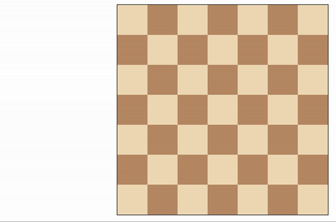

# Build a Game-playing Agent



## Synopsis

Isolation is a deterministic, two-player game of perfect information in which the players alternate turns moving a single piece from one cell to another on a board.  Whenever either player occupies a cell, that cell becomes blocked for the remainder of the game.  The first player with no remaining legal moves loses, and the opponent is declared the winner.

This project uses a version of Isolation where each agent is restricted to L-shaped movements (like a knight in chess) on a rectangular grid (like a chess or checkerboard).  The agents can move to any open cell on the board that is 2-rows and 1-column or 2-columns and 1-row away from their current position on the board. Movements are blocked at the edges of the board (the board does not wrap around), however, the player can "jump" blocked or occupied spaces (just like a knight in chess).

Additionally, agents will have a fixed time limit each turn to search for the best move and respond.  If the time limit expires during a player's turn, that player forfeits the match, and the opponent wins.

These rules are implemented in the `isolation.Board` class provided in the repository. 

## Heuristic Analysis

I have implemented three heuristics methods that gradually build upon each other, improving winning results as verified by evaluating performance of agents using it on a reasonable amount of game matches. All of them exploit the same idea based on the position of available moves and winning statistics based on those moves. Generally speaking, the closer player position to the board center the stronger it is in terms of winning, we use this fact as each of the described heuristic methods penalizes available moves if those are far from the board center. Reasoning behind it being that with L-shape moves there are generally less available moves over the next N iterations the closer you are to the board edge.

* **Distance from edges (`custom_score_v1()`)**. Calculates the sum of distances of each of the available moves to the board edges.
* **Weighted distance from edges (`custom_score_v2()`)**. Adds constant weights to the previous sum, as well as a constant bias for each available move.
* **Dynamically weighted distance from edges (`custom_score_v3()`)**. Assigns dynamic weights to the previous heuristic, based on the number of available cells on the board.

Each heuristic calculates player and opponent scores and returns their difference. Described heuristics capture various information about available moves, but generally speaking terminology is as follows: _weight_ is the coefficient we apply to the available move distance from the edge of the board, and _bias_ is a coefficient we apply to the fact that we have a move.

### Distance from edges (`custom_score_v1()`)
First we try a very straightforward approach of penalizing available moves that are further away from the center of the board, we simply calculate a sum of distances of available moves from the board edges for each player, and then return the difference. Just as one would expect this obvious approach didn't yield good results and actually turned out to be worse than _ID Improved_ from the lectures.

Using weights-bias terminology weights are equal to `1` and bias is equal to `0`.

```
*************************
 Evaluating: ID_Improved 
*************************

Playing Matches:
----------
  Match 1: ID_Improved vs   Random      Result: 160 to 40
  Match 2: ID_Improved vs   MM_Null     Result: 152 to 48
  Match 3: ID_Improved vs   MM_Open     Result: 131 to 69
  Match 4: ID_Improved vs MM_Improved   Result: 117 to 83
  Match 5: ID_Improved vs   AB_Null     Result: 147 to 53
  Match 6: ID_Improved vs   AB_Open     Result: 128 to 72
  Match 7: ID_Improved vs AB_Improved   Result: 114 to 86

Results:
----------
ID_Improved         67.79%

*************************
 Evaluating: Student v1   
*************************

Playing Matches:
----------
  Match 1: Student v1  vs   Random      Result: 168 to 32
  Match 2: Student v1  vs   MM_Null     Result: 146 to 54
  Match 3: Student v1  vs   MM_Open     Result: 103 to 97
  Match 4: Student v1  vs MM_Improved   Result: 107 to 93
  Match 5: Student v1  vs   AB_Null     Result: 138 to 62
  Match 6: Student v1  vs   AB_Open     Result: 130 to 70
  Match 7: Student v1  vs AB_Improved   Result: 123 to 77

Results:
----------
Student v1          65.36%
```

### Weighted distance from edges (`custom_score_v2()`)
Second approach extends the `custom_score_v1()` function by adding a constant value for each available move to the player and opponent score. After all the fact that we have a move is pretty important and generally carries more information that just a distance from the board edge. Distance, of course, is still a part of the score, although scaled to be in [0, 1] range and weighted with a constant coefficients of `0.5` for width and height. This heuristic performs much better, and from my initial tests already yields better results than _ID Improved_ (which never got past 70% on my machine).

Using weights-bias terminology weights are equal to `0.5` and bias is equal to `1`.

```
*************************
 Evaluating: ID_Improved 
*************************

Playing Matches:
----------
  Match 1: ID_Improved vs   Random      Result: 154 to 46
  Match 2: ID_Improved vs   MM_Null     Result: 154 to 46
  Match 3: ID_Improved vs   MM_Open     Result: 123 to 77
  Match 4: ID_Improved vs MM_Improved   Result: 124 to 76
  Match 5: ID_Improved vs   AB_Null     Result: 152 to 48
  Match 6: ID_Improved vs   AB_Open     Result: 125 to 75
  Match 7: ID_Improved vs AB_Improved   Result: 127 to 73

Results:
----------
ID_Improved         68.50%

*************************
 Evaluating: Student v2  
*************************

Playing Matches:
----------
  Match 1: Student v2  vs   Random      Result: 159 to 41
  Match 2: Student v2  vs   MM_Null     Result: 160 to 40
  Match 3: Student v2  vs   MM_Open     Result: 135 to 65
  Match 4: Student v2  vs MM_Improved   Result: 124 to 76
  Match 5: Student v2  vs   AB_Null     Result: 150 to 50
  Match 6: Student v2  vs   AB_Open     Result: 131 to 69
  Match 7: Student v2  vs AB_Improved   Result: 131 to 69
 
Results:
----------
Student v2          70.71%
```

### Dynamically weighted distance from edges (`custom_score_v3()`)
The main highlight of the third version of our heuristic is dynamic weights that we assign to the fact that a move is present and to its distance from the board edge. As I've mentioned earlier, the fact that we have a move is fairly important, however, it is _more important_ if we are running out of available empty cells on the board, and _less important_ if we still a lot of non-occupied cells. In order to capture that info we make player score weights and bias dependent on the fraction of empty cells on the board. The more there are empty cells the higher the bias (e.g. the fact that we _have_ available move, not _how good_ it is). This approach performs slightly better than the one with fixed weights and biases.

Using weights-bias terminology weights are equal to `(blank_cells / total_cells) / 2` and bias is equal to `1 - (blank_cells / total_cells)`.

```
*************************
 Evaluating: ID_Improved 
*************************

Playing Matches:
----------
  Match 1: ID_Improved vs   Random      Result: 163 to 37
  Match 2: ID_Improved vs   MM_Null     Result: 147 to 53
  Match 3: ID_Improved vs   MM_Open     Result: 119 to 81
  Match 4: ID_Improved vs MM_Improved   Result: 129 to 71
  Match 5: ID_Improved vs   AB_Null     Result: 145 to 55
  Match 6: ID_Improved vs   AB_Open     Result: 129 to 71
  Match 7: ID_Improved vs AB_Improved   Result: 116 to 84
 

Results:
----------
ID_Improved         67.71%

*************************
 Evaluating: Student v3  
*************************

Playing Matches:
----------
  Match 1: Student v3  vs   Random      Result: 156 to 44
  Match 2: Student v3  vs   MM_Null     Result: 159 to 41
  Match 3: Student v3  vs   MM_Open     Result: 137 to 63
  Match 4: Student v3  vs MM_Improved   Result: 129 to 71
  Match 5: Student v3  vs   AB_Null     Result: 154 to 46
  Match 6: Student v3  vs   AB_Open     Result: 135 to 65
  Match 7: Student v3  vs AB_Improved   Result: 134 to 66
 

Results:
----------
Student v3          71.71%
```

## Results
Scoring methods described here are very basic, and undoubtedly won't beat the world Isolation champion. They are, however, fairly intuitive, can be easily vectorized and seem to represent an iterative process of gradually improving game agent's heuristic.
